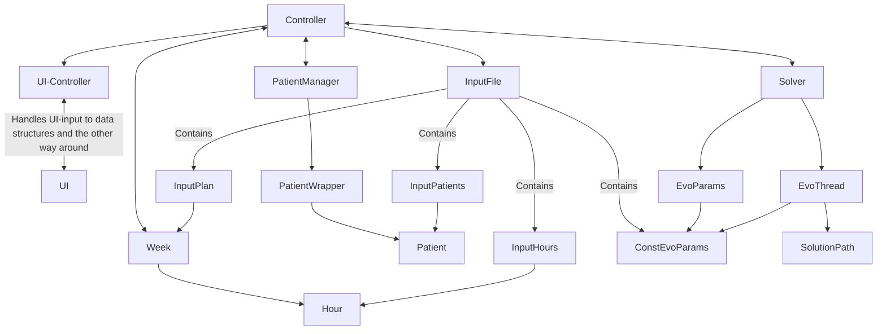

__Internal Documentation for bug hunting__

This document is for general class and data documentation.

It will document always the current data and class structure of the latest release.

> **Note:** Make sure your markdown preview supports Mermaid diagrams. 

__V1.0.0__

* __Class Hierarchy__



* __Data Structure__

    * hours.json

        Dictionary with the days as keys and lists containing the  hours as values.
        Each hour itself is a dictionary with  "time" key mapping to four letter time in the 24h format without any separators (ex. "1430" for 2:30 pm). And a "duration" specifier, mapping to an int of the duration of the hour in minutes.

        json structure visualized
        ```
        {
            "Monday" : [
                {
                    "time" : "0700",
                    "duration" : 50
                },
                {
                    "time" : "0700",
                    "duration" : 50
                },
                ...
            ],
            "Tuesday" : [
                {
                    "time" : "0900",
                    "duration" : 50
                },
                ...
            ],
            ...
        }
        ```
    * patients.json

        list of patient dictionaries. Each dictionary maps "name" to a string and "possible hours" to a list of integers.
        Name is obvious what is means, "possible hours" is less obvious. Each hour gets an unique ID internally, if the patient can attend to this specific hour, the ID is added to the list.

        ```
        [
            {
                "name" : "Max",
                "possible hours" : [1, 16, 32, 73]
            }, {
                "name" : "Elisa",
                "possible hours" : [3, 6, 32, 4]
            },
            ...
        ]
        ```
    * __evo_parameters.json__

        Parameter for evaluation of a solution. Used in the EvoThread. The meaning of the values are in the SolutionPath class.

        "sample_size" can be changed, without major problems to consider. In simple terms: Bigger number -> better result,more RAM usage, longer time

        ```
        {
            "sample_size" : 100000,

            "reward_per_patient": 10,
            "reward_consecutive_hours": 2.5,
            "reward_time_limit": -10
        }

    * __*plan.json__

        The file is optional. After changes to the hours.json and/or patients.json file, it is recommended to delete this file also as it may now references outdated/non existent data.

        It stores a list of all hours, with the addition of the patient attends the hour.

        The hour dict looks that way:

        ```
        {
            "hourID" : int # Internal ID of the hour
            "time" : str  # see hours.json
            "duration" : int  # see hours.json
            "taken_by" : str|None # Name of the patient, if no patient null
        }
        ```
        The plans.json file has the following structure:
        ```
        [
            {
                "hourID": 0,
                "time": "0750",
                "duration": 50,
                "taken_by": null
            },
            {
                "hourID": 1,
                "time": "0840",
                "duration": 50,
                "taken_by": "Peter"
            },
            {
                "hourID": 2,
                "time": "0930",
                "duration": 50,
                "taken_by": "Emanuel"
            },
            ...
        ]
        ```


